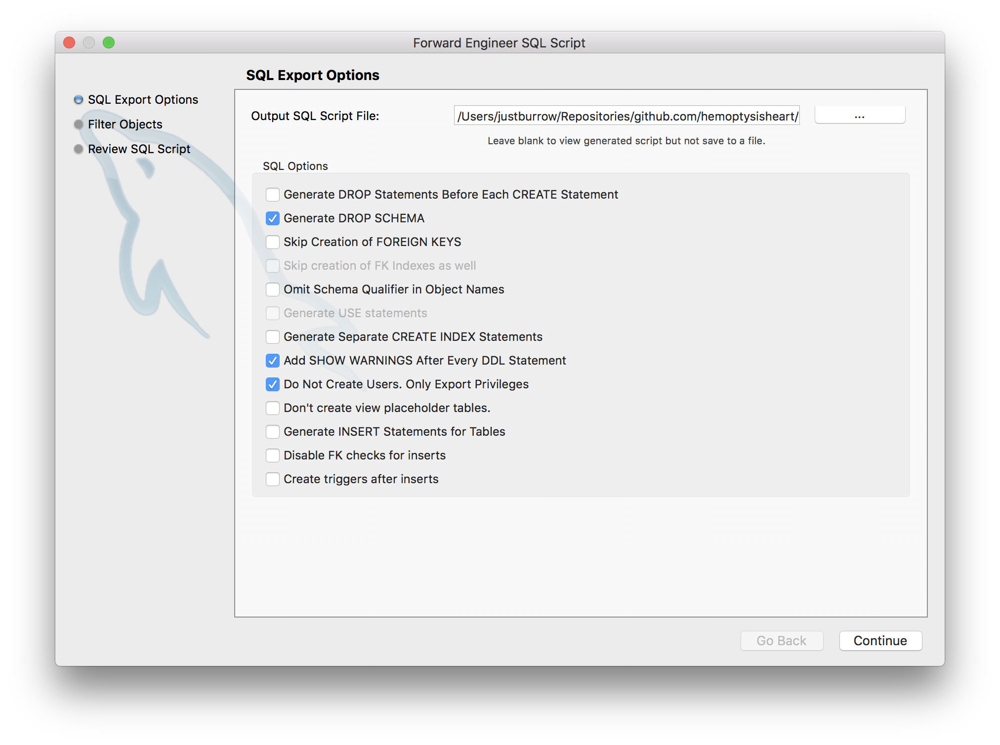

# Ch.05 - DB 연동

현실적으로는 DB에 연동해야만 데이터를 잃어버리지 않고 저장하고 사용할 수 있다.
MySQL을 사용한 데이터 저장을 시도한다.

## STEP 1 - 연결할 DB 만들기

회원 가입한 계정 정보를 저장해야 한다.
해당 DB를 만든다. DB 스키마 작성은 MySQL Workbench를 사용한다.
MySQL Workbench에서 모델을 만들고 DDL을 생성하면,
DDL의 테이블 순서가 유지된다.
이것은 DB 변경을 추적하기 위해 매우 중요한 특징이 된다.
(`mysqldump`는 순서가 유지되지 않는다.)

모델을 추가한다.
스키마 이름을 변경하고, `Default Collation`을 `utf8mb4 - utf8mb4_bin`으로 변경한다.
DDL에서 스키마의 `character set`을 `utf8mb4`로, `collate`를 `utf8mb4_bin`으로 설정된다.


MySQL Workbench가 DDL 생성시 스키마를 생성하려면 테이블이 하나는 필요하다.
임시로 PK만 있는 테이블을 추가한다. 이후 회원 가입한 계정 정보 저장에 사용한다.


`Menu > File > Export > Forward Engineer SQL CREATE Script...`(<kbd><kbd>shift</kbd> + <kbd>command</kbd> + <kbd>G</kbd></kbd>)로 DDL파일(`*.sql`)을 생성한다.



DDL을 실행해 스키마를 생성한다.


### 프로젝트 구조

```
.
├── db
│   ├── tutorial_spring_web.mwb
│   └── tutorial_spring_web.sql
├── pom.xml
└── src
    └── main
        ├── java
        │   └── hemoptysisheart
        │       └── github
        │           └── com
        │               └── tutorial
        │                   └── spring
        │                       └── web
        │                           ├── ApplicationRunner.java
        │                           ├── RootController.java
        │                           └── SignUpReq.java
        └── resources
            ├── application.yml
            └── templates
                └── _
                    ├── index.html
                    └── signup.html
```

[전체 구조](step_1_tree.txt)